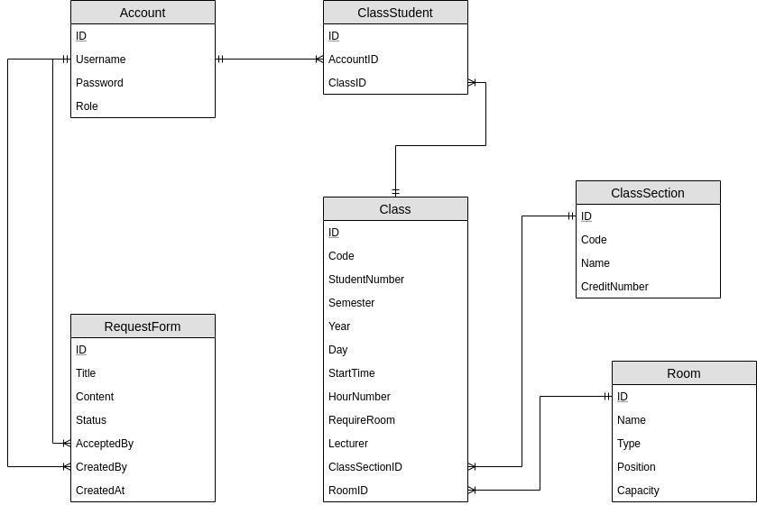

# Mục Lục
1. [Chương 1: Tổng quan về phần mềm](#introduction)
2. [Mô tả chức năng có trong phần mềm](#paragraph1)
    1. [Bảng chức năng](#subparagraph1)

## Chương 1: Tổng Quan 
Hiện nay, do nhu cầu quản lý và sắp xếp lịch trình ngày càng cần thiết trong cuộc sống. Việc lên lịch giúp mọi người có thể quản lý, sắp xếp công việc một cách hợp lý, đúng quy trình. Nhất là trong môi trường có tính tổ chức cao như trường học, công sở. Nhằm phục vụ nhu cầu đó, nhóm đã phát triển phần mềm “quản lý sắp xếp và cho mượn phòng học”. Phần mềm có tác dụng giúp đỡ trường học trong khâu quản lý và sắp xếp phòng học nhằm phục vụ mục đích học tập, giao lưu và sinh hoạt lớp của sinh viên. Phần mềm của nhóm gồm có hai phần: Sắp xếp phòng học theo lịch học và danh sách kèm theo thông tin phòng học có sẵn và xử lý các đơn yêu cầu mượn phòng học của sinh viên.

### Công nghệ sử dụng
- Server backend: Nodejs + express framework
- Database: Postgres
- App Frontend: Reactjs

## Chương 2: Mô tả chức năng 
Phần mềm “quản lý sắp xếp và cho mượn phòng học” của nhóm gồm có các chức năng được mô tả trong bảng sau:

### Bảng chức năng 
| STT |Tên Chức Năng | Đối Tượng | Mô Tả|
|-----|--------------|-----------|------|
|1|Phê duyệt các đơn mượn phòng|Nhân viên phòng đào tạo|Nhân viên phòng đào tạo lấy yêu cầu phê duyệt mượn phòng của sinh viên, sau đó xét duyệt và trả lời: chấp nhận hoặc không chấp nhận.|
|2|Gửi lịch học cho sinh viên|Nhân viên phòng đào tạo|Sau khi sắp xếp thành công lịch học, nhân viên phòng đào tạo gửi lịch trình đã sắp xếp cho sinh viên toàn trường. Trong đó có các mục: tên lớp, sĩ số, thời gian, địa điểm,…|
|3|Xem lịch học|Sinh viên|Sinh viên có thể lên trang phòng đào tạo cung cấp để xem lịch học của bản thân. Trong đó, phòng đào tạo cung cấp các thông tin như: mã môn học, tên môn học, địa điểm, thời gian, sĩ số, tên giảng viên,…|
|4|Gửi yêu cầu mượn phòng học|Sinh viên|Sinh viên lên hệ thống, điền thông tin và tìm khoảng thời gian và phòng còn trống thích hợp. Sau đó đợi xác nhận của phòng đào tạo.|
|5|Xem lịch dạy|Giảng viên|Giảng viên truy cập trang web phòng đào tạo cung cấp để xem lịch dạy của bản thân. Trong đó, phòng đào tạo cung cấp các thông tin như: mã môn học, tên môn học, thời gian, địa điểm, danh sách sinh viên.|
|6|Quản lý các đối tượng chung|Nhân viên phòng đào tạo|Quản lý các đối tượng: phòng học, lớp môn học, tài khoản người dùng|
|7|Tự động hóa việc xếp lịch|Nhân viên phòng đào tạo|Sử dụng thông tin từ các đối tượng phòng học, lớp môn học để xếp lịch lớp và phòng học|

Các Actors:
-   	Nhân viên phòng đào tạo: nhân viên của trường đại học
-       Sinh viên: Sinh viên thuộc quản lý trường đại học
-       Giảng viên: Giảng viên dạy học trong trường

### Mô hình Cơ sở dữ liệu 

